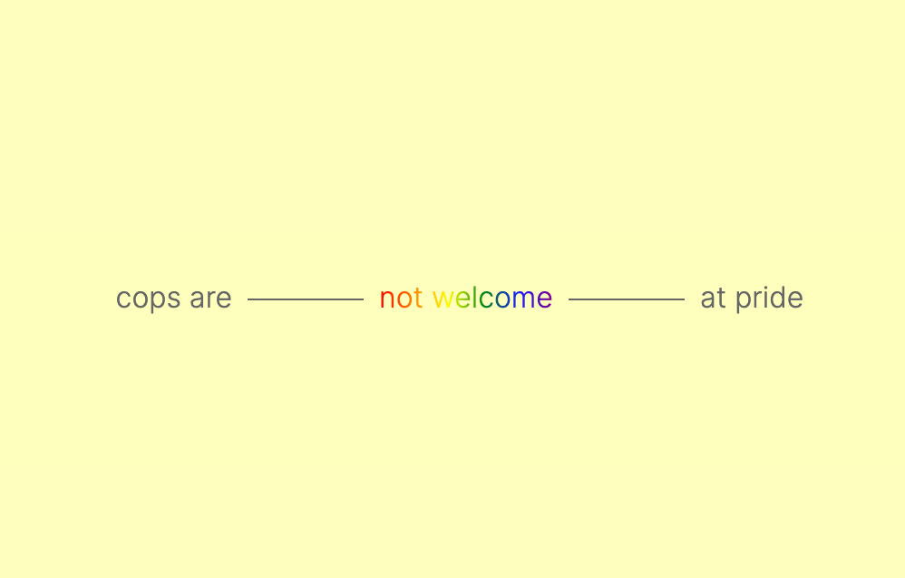

<h1 align="center">What Or Whom We Love</h1>



### Abstract
Easy rainbow text for friends and allies!

⚠️ Do not use this for your business page. This should be used by personal or non-profits only. See the license for more details.

Based on the colours from Gilbert Baker's 1979 updated rainbow flag design. You can read a bit more about the history of the design and what it means from [this article on Wikipedia](https://en.wikipedia.org/wiki/Rainbow_flag_%28LGBT_movement%29).

### Features
- Rainbow gradient text.
- Hard colour stops, like those on the flag; or soft gradient stops. Your choice.
- Pure JS. No external libraries.

Installation
----

`npm install what-or-whom-we-love`

Include `what-or-whom-we-love.min.js"` at the end of your `body`. Afterwards, call `whomWeLove();`, and pass your options.

**Important** — Make sure that the `<div>` or `<span>` you're targeting contains text, or it will just make the background of the div the LGBTQA+ flag (although..... this could be a feature lol).

```html
	<script type="text/javascript" src="what-or-whom-we-love.min.js"></script>
	<script type="text/javascript">
		whomWeLove({
			howWeLove: "gradient",
			whereToShowVisibility: ".here"
		});
	</script>
</body>
```

Options: `'Defaults'`
---

```js
whomWeLove({
	howWeLove: 'stops',
		// choose how you show colour stops.
		// current options are:
			// `stops` (hard colour stops)
			// `gradient`, and
			// `gradient-p` (gradient with some padding)
	whereToShowVisibility: '.here-i-am'
		// this the text you would like to apply pride colours to
});
```

### Notes
- Animate them if you like. In your CSS animate `background-position` in your keyframes, and add `background-size: 200% 0%` to your target div (see the [example](example.html)).
- Q — "Couldn't you just do this with CSS?", A — Sure. [Here](dist/what-or-whom-we-love.css).

### "Would be nice"s
- It would be nice to be able to target all the text on a site. Right now if you target the body (or any div without text inside it) it makes the entire div's background the flag, and all the children inside inherit the same styles. While this is cool it is not ideal.
- Would be nice to have a gradient that starts and ends on red. Would make it nicer easier to animate.
- Would be nice to have support for other queer flag colours. This would be fairly easy to add in.

---

### Colophon
The name "What Or Whom We Love" is an interpolation from Maggie Nelson's *Bluets*. Here's the full line it comes from:
> We don’t get to choose what or whom we love, I want to say. We just don’t get to choose.

The type used in the demo image is *Inter Light* by [Rasmus Andersson](https://rsms.me/inter/).

<br/><br/><br/>

<p align="center">made w love</p>
<a href="https://isoradio.to" target="_blank" align="center"></a>
